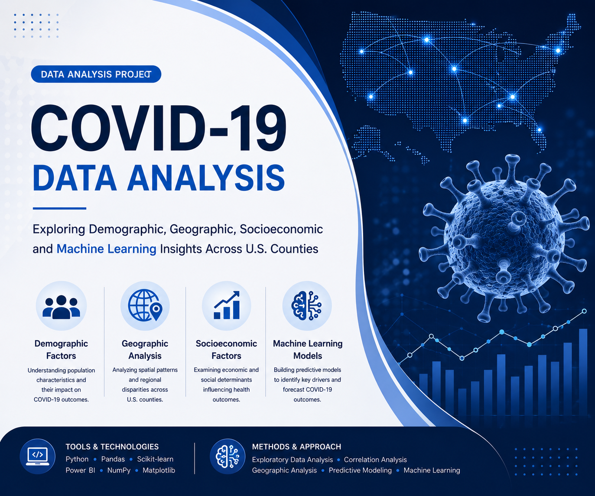

# covid19-us-county-analysis
Analysis of COVID-19 case and death rates across U.S. counties using demographic, geographic, socioeconomic, and machine learning techniques.

# COVID-19 US County Analysis

## Project Overview

This project explores the factors associated with COVID-19 case and death rates across U.S. counties using demographic, geographic, socioeconomic, health, and machine learning analyses.

The goal was to identify patterns that may help explain variations in COVID-19 outcomes and evaluate the predictive power of different county-level indicators.

---

## Dataset

The analysis combines multiple county-level datasets containing:

* COVID-19 Cases and Deaths
* Demographic Variables
* Socioeconomic Indicators
* Health Factors
* Geographic Information

The final dataset includes thousands of county-level observations across the United States.

---

## Project Objectives

* Analyze COVID-19 case and death rates across U.S. counties
* Investigate demographic influences
* Examine health-related risk factors
* Explore socioeconomic determinants
* Identify geographic patterns
* Build predictive models for COVID-19 outcomes

---

## Tools & Technologies

* Python
* Pandas
* NumPy
* Matplotlib
* Scikit-learn
* Power BI
* Kaggle Notebooks

---

## Key Findings

### Demographic Factors

* Population under 18 showed a positive association with case rates.
* Population aged 65+ showed measurable relationships with both case and death rates.

### Health Factors

* Individual health indicators such as obesity, diabetes, smoking, and physical inactivity showed relatively weak associations with COVID-19 outcomes.

### Socioeconomic Factors

Several socioeconomic variables demonstrated stronger relationships than most health indicators, including:

* Long commute drives alone
* Rural population
* Children in poverty
* Disconnected youth
* Educational attainment
* Homicide rate

### Geographic Analysis

Substantial regional variation was observed across U.S. counties, suggesting local demographic and socioeconomic conditions influenced outcomes.

---

## Machine Learning Results

Multiple Linear Regression models were developed to predict COVID-19 outcomes.

| Model            | R² Score |
| ---------------- | -------- |
| Case Rate Model  | 21.1%    |
| Death Rate Model | 22.4%    |

The results indicate that demographic and socioeconomic variables contribute to explaining COVID-19 outcomes, although additional unmeasured factors likely played an important role.

---

## Power BI Dashboard

The project includes an interactive Power BI dashboard featuring:

* COVID-19 Overview
* Rate Analysis
* Health Factor Analysis
* Predictive Modeling
* Correlation Analysis
* Geographic Analysis
* Demographic Analysis
* Final Conclusions

---

## Kaggle Notebook

Kaggle Notebook Link:

[https://www.kaggle.com/code/monte81/covid19]

---

## Author

**Sengül Özaydın**

Data Sciencist | Health Data Analyst | Veterinarian

